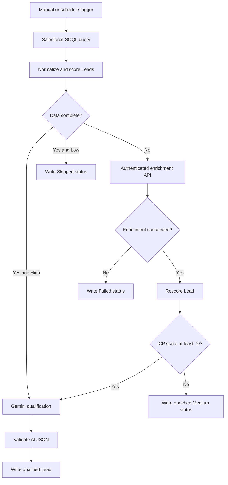

# AI-Powered GTM Lead Qualification and Enrichment Engine

An n8n-based functional prototype that retrieves pending Salesforce Leads, evaluates data completeness, calculates an explainable ICP score, enriches incomplete company records through an authenticated REST API, invokes Gemini only for qualified Leads, and writes outcomes back to Salesforce.

## Business problem

GTM teams often qualify Leads through disconnected manual steps: inspecting CRM records, requesting enrichment, applying scoring rules, researching the account, and updating the CRM. This workflow turns those handoffs into one governed orchestration while preserving deterministic scoring and using an LLM only where it adds value.

## What the prototype demonstrates

- Salesforce REST API integration using OAuth 2.0 Client Credentials
- SOQL retrieval of pending Lead records
- JavaScript normalization, completeness checks, and explainable ICP scoring
- Conditional routing across enrichment, AI qualification, and low-priority paths
- Authenticated mock enrichment API with explicit `200`, `404`, and `422` contracts
- Post-enrichment rescoring before Gemini invocation
- Grounded Gemini prompts and defensive JSON-response validation
- Salesforce PATCH write-back across five terminal business outcomes
- Manual and 15-minute schedule triggers, with the exported workflow inactive by default

## Architecture



## Decision logic

| Condition | Action | Salesforce outcome |
| --- | --- | --- |
| Required company data is missing | Call enrichment API and rescore | Continue based on new score |
| Complete record and ICP score >= 70 | Invoke Gemini | Completed with AI summary |
| Enriched record scores below 70 | Skip Gemini | Completed with enriched CRM data |
| Enrichment request is invalid or unknown | Capture structured API error | Failed |
| Complete record scores below 70 | Skip enrichment and Gemini | Skipped |

The LLM does not determine the ICP score. A deterministic 100-point model makes the qualification gate explainable, repeatable, and less expensive. Gemini generates a concise qualification summary and recommended sales action only after the Lead passes that gate.

## ICP scoring model

| Dimension | Maximum points |
| --- | ---: |
| Industry fit | 15 |
| Employee count | 15 |
| Annual revenue | 10 |
| Buyer persona | 25 |
| Intent signal | 25 |
| Data completeness | 10 |
| **Total** | **100** |

- High: 70-100
- Medium: 40-69
- Low: 0-39

See [Scoring Logic](docs/scoring-logic.md) for the complete rules.

## Validated scenarios

The prototype was exercised with 12 synthetic Leads. The test set covered seven initially AI-ready Leads, three incomplete Leads, and two low-priority Leads. Additional API tests validated successful enrichment, unknown-company handling, and missing-domain handling.

Representative outcomes included:

- Direct high-fit qualification and Gemini write-back
- Enrichment followed by movement from Medium to High and Gemini qualification
- Enrichment followed by a Medium outcome without an LLM call
- Controlled `422 MISSING_DOMAIN` failure written to Salesforce
- Low-priority Lead marked `Skipped` to prevent repeated processing

## Repository contents

```text
workflows/  Sanitized n8n workflow exports
docs/       Data model, scoring, API contract, testing, and setup
samples/    Synthetic Lead data and API payloads
```

## Setup

1. Create the Salesforce Lead fields in [Salesforce Data Model](docs/salesforce-data-model.md).
2. Create a Salesforce External Client App with the API scope and OAuth Client Credentials flow.
3. Import both JSON files from `workflows/` into n8n.
4. Create credentials named `Salesforce GTM OAuth`, `Gemini GTM API`, and `Mock Enrichment API Auth` or reselect your own credentials in each node.
5. Replace `YOUR_SALESFORCE_MY_DOMAIN` and `YOUR_N8N_HOST` in the imported workflow.
6. Activate the mock enrichment workflow so its production webhook is registered.
7. Keep the main workflow inactive until production-hardening controls have been completed; use the Manual Trigger for controlled testing.

## Security

The checked-in exports contain no API keys, OAuth client secrets, access tokens, credential IDs, personal Salesforce domain, or personal n8n hostname. Store secrets only in the n8n credential manager. Never commit exported credentials or screenshots containing secret values.

## Current scope and planned hardening

This repository represents a tested functional prototype, not a production deployment. Planned improvements include centralized error workflows, per-record processing locks for overlapping schedules, verified retries and backoff, operational alerts, execution metrics, and promotion of shared scoring logic into a reusable sub-workflow.

## Technology

Salesforce, n8n, REST APIs, OAuth 2.0, SOQL, JavaScript, JSON, webhooks, Google Gemini, GitHub
## Companion Project: Clay Account Enrichment and Personalization

A standalone Clay workflow that processes five target accounts through company enrichment, public data-intelligence signal research, and AI-generated persona-specific outreach.

This workflow demonstrates hands-on experience with Clay Workflows, Claygent, prompt engineering, upstream input mapping, enrichment, and grounded personalization. It is a separate companion prototype and is not directly integrated with the Salesforce–n8n workflow.

[View the Clay project](./clay-account-enrichment/)
