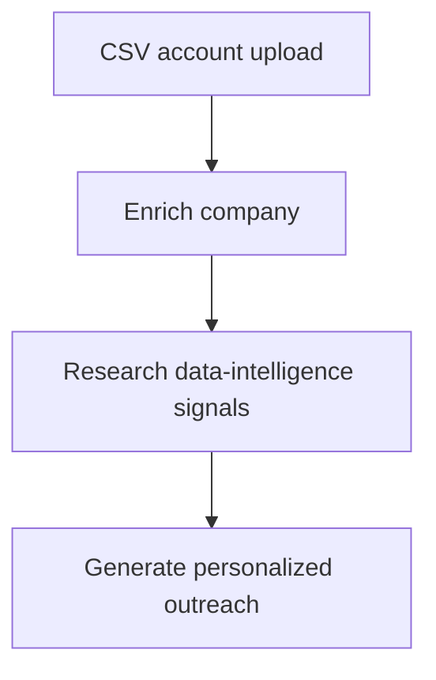
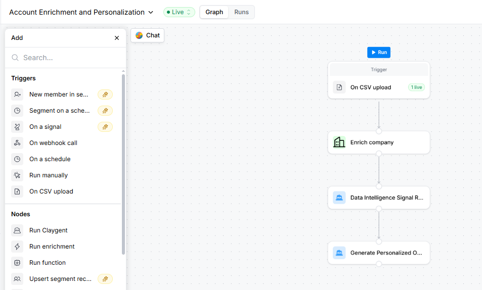
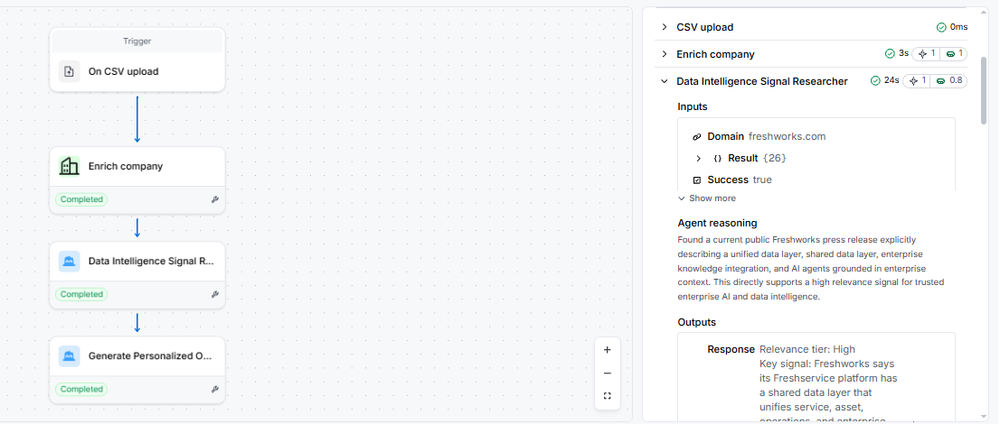
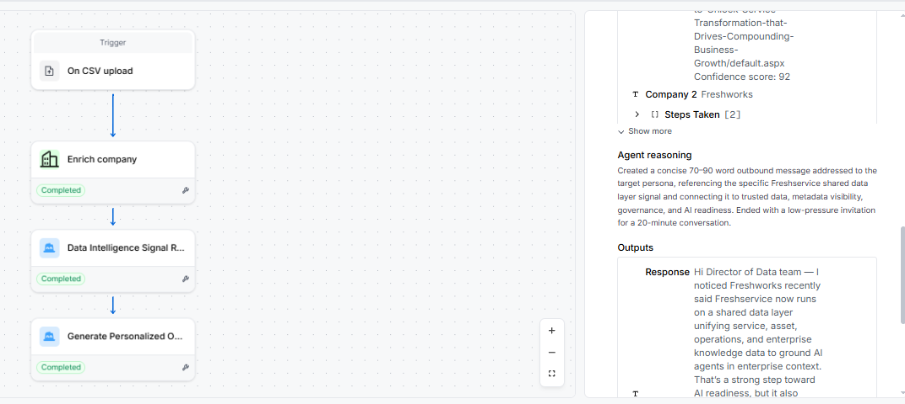

# Clay Account Enrichment and Personalization

## Overview

This companion project demonstrates a lightweight, AI-assisted account research and outbound-personalization workflow built in Clay. It enriches a small target-account list, researches public data-intelligence signals, and generates grounded outreach for a target buying persona.

The workflow was designed as a focused extension of the larger [AI GTM Lead Qualification Engine](https://github.com/chaithraambuga-cloud/ai-gtm-lead-qualification-engine), which handles Salesforce lead qualification, enrichment routing, Gemini analysis, and CRM write-back through n8n.

## Business problem

GTM teams often research accounts and draft personalized outreach manually. That creates inconsistent messaging and increases the time between identifying an account and taking action. This workflow automates the repeatable research and drafting steps while requiring AI output to remain grounded in public company information.

## Workflow

### Nodes

| Step | Clay node | Purpose |
|---|---|---|
| 1 | On CSV upload | Creates one workflow run for every target account |
| 2 | Enrich company | Retrieves company-level firmographic information |
| 3 | Data Intelligence Signal Researcher | Uses Claygent to identify public signals related to data governance, metadata management, analytics governance, cloud data transformation, or trusted enterprise AI |
| 4 | Generate Personalized Outreach | Uses the account signal, target persona, and intent score to draft a concise, grounded outbound message |

## Input data

The test dataset contains five target accounts and four input fields:

- `Domain`
- `Company`
- `Intent_Score`
- `Target_Persona`

The accounts used were Freshworks, Chargebee, BrowserStack, Whatfix, and Zoho. The dataset is provided for portfolio demonstration and does not contain personal contact information.

## AI guardrails

The research and personalization prompts were configured to:

- Use publicly verifiable company information.
- Avoid inventing technologies, initiatives, customers, contacts, or business problems.
- Identify a specific signal before generating outreach.
- Address a target role rather than fabricate an individual recipient.
- Connect the signal to trusted data, governance, metadata, analytics, or AI readiness.
- Produce a concise message with a low-pressure call to action.

## Validation

All five account runs completed successfully across all four nodes. The Freshworks validation confirmed that the generated message:

- Addressed the Director of Data persona.
- Referenced a public enterprise-AI governance signal.
- Connected the signal to trusted data and metadata governance.
- Ended with a 20-minute conversation request.
- Avoided fabricated people and unsupported claims.

## Screenshots

### Published workflow

### AI research output

### Personalized outreach output

## Tools and skills demonstrated

- Clay Workflows
- Company enrichment
- Claygent agent configuration
- Prompt engineering and input mapping
- Public-signal research
- AI-generated GT outbound personalization
- Grounding and hallucination controls
- Batch validation using CSV-triggered workflow runs

## Scope and limitations

This is a small portfolio prototype using five target accounts. It generates draft outreach for human review and does not send messages automatically. CRM write-back is handled separately in the Salesforce and n8n qualification engine.

